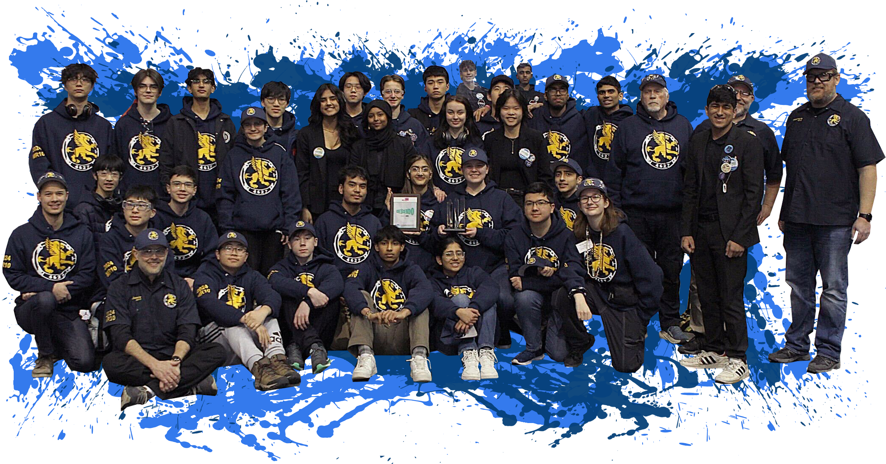

# Manning Robotics - Official Website

[](https://opensource.org/licenses/MIT)
[](https://developer.mozilla.org/en-US/docs/Web/HTML)
[](https://developer.mozilla.org/en-US/docs/Web/CSS)
[](https://developer.mozilla.org/en-US/docs/Web/JavaScript)

> Official website for FRC Team 4627 - Manning Robotics, representing Ernest Manning High School in Calgary, Alberta, Canada.

## 📋 Table of Contents

- [About](#about)
- [Features](#features)
- [Technologies Used](#technologies-used)
- [Project Structure](#project-structure)
- [Getting Started](#getting-started)
- [Installation](#installation)
- [Development](#development)
- [Deployment](#deployment)
- [Contributing](#contributing)
- [Code Style Guide](#code-style-guide)
- [Testing](#testing)
- [Performance](#performance)
- [Browser Support](#browser-support)
- [Team](#team)
- [Sponsors](#sponsors)
- [License](#license)
- [Contact](#contact)

## 🤖 About

Manning Robotics is FRC Team 4627, established in 2013 at Ernest Manning High School in Calgary, Alberta. Starting with just 10 students and 3 mentors, we have grown into a team of 45+ students with 12 teachers and volunteer mentors. We have proven ourselves both nationally and internationally, winning over 21 awards across our competitive history.

This website serves as our digital presence, showcasing our team's achievements, current projects, award history, and providing information for potential sponsors, students, and the robotics community.

### 🏆 Key Achievements
- **2024**: Excellence in Engineering Award - Canadian Pacific Regional
- **2023**: Autonomous Award - Canadian Pacific Regional  
- **2022**: Creativity Award - Canadian Pacific Regional
- **2013**: Rookie All Star Award - Western Canada Regional (our founding year)

## ✨ Features

### 🎨 User Interface
- **Responsive Design**: Optimized for desktop, tablet, and mobile devices
- **Dark/Light Theme Toggle**: User preference with localStorage persistence
- **Smooth Animations**: Scroll-triggered reveal animations with customizable delays
- **Modern Typography**: Clean, readable font stack with Onest as primary font
- **Accessible Navigation**: Keyboard navigation support and semantic HTML

### 🔧 Functionality
- **Interactive Navigation**: Smooth scroll navigation with active section highlighting
- **Mobile-First Design**: Hamburger menu for mobile devices
- **Sponsor Carousel**: Infinite horizontal scrolling sponsor showcase
- **Award Gallery**: Horizontal scrollable awards section with drag support
- **Contact Form**: Netlify-integrated contact form with validation
- **Social Media Integration**: Links to all team social platforms

### 📱 Responsive Breakpoints
- **Mobile**: < 768px
- **Tablet**: 768px - 992px  
- **Desktop**: 992px - 1200px
- **Large Desktop**: > 1200px

## 🛠 Technologies Used

### Frontend
- **HTML5**: Semantic markup with accessibility considerations
- **CSS3**: Custom properties, Flexbox, Grid, animations
- **Vanilla JavaScript**: ES6+ features, no framework dependencies
- **jQuery**: Used sparingly for award section drag functionality

### External Libraries & APIs
- **Ionicons**: Icon library for consistent iconography
- **Google Fonts**: Onest font family
- **Netlify Forms**: Form handling and submission

### Development Tools
- **Git**: Version control
- **Browser DevTools**: Testing and debugging
- **Lighthouse**: Performance and accessibility auditing

## 📁 Project Structure

```
Robotics-Website-main/
├── assets/
│   ├── css/
│   │   └── style.css              # Main stylesheet with responsive design
│   ├── images/
│   │   ├── hero-banner.png        # Main hero image
│   │   ├── logo.png               # Team logo
│   │   ├── thor.png               # Featured robot image
│   │   ├── project-[1-7].png      # Project showcase images
│   │   ├── first.png              # FIRST Robotics logo
│   │   └── sponsors/              # Sponsor logo directory
│   │       ├── agrosy-fund.png
│   │       ├── bunch-projects.png
│   │       ├── calgary-flames.png
│   │       ├── cornerstone-engineering.png
│   │       ├── enerflex.png
│   │       ├── gene-haas-foundation.png
│   │       ├── klohn-crippen-berger.png
│   │       ├── rangeland-engineering.png
│   │       ├── seebe.png
│   │       └── spartan-control.png
│   ├── js/
│   │   └── script.js              # Main JavaScript functionality
│   └── lib/
│       └── jquery-3.7.1.min.js    # jQuery library
├── favicon.png                    # Site favicon
├── index.html                     # Main HTML file
├── LICENSE                        # MIT License
└── README.md                      # Project documentation
```

## 🚀 Getting Started

### Prerequisites
- A modern web browser (Chrome, Firefox, Safari, Edge)
- Basic text editor or IDE (VS Code, Sublime Text, etc.)
- Local web server (optional, for development)

### Quick Start
1. **Clone the repository**
   ```bash
   git clone https://github.com/4627ManningRobotics/Robotics-Website.git
   cd Robotics-Website
   ```

2. **Open the website**
   - **Option A**: Open `index.html` directly in your browser
   - **Option B**: Use a local server (recommended for development)

## 🔧 Installation

### Method 1: Direct File Access
```bash
# Clone the repository
git clone https://github.com/4627ManningRobotics/Robotics-Website.git
cd Robotics-Website

# Open in browser
open index.html  # macOS
start index.html # Windows
xdg-open index.html # Linux
```

### Method 2: Local Development Server

#### Using Python
```bash
# Python 3
python -m http.server 8000

# Python 2
python -m SimpleHTTPServer 8000

# Visit http://localhost:8000
```

#### Using Node.js
```bash
# Install http-server globally
npm install -g http-server

# Start server
http-server

# Visit http://localhost:8080
```

#### Using Live Server (VS Code Extension)
1. Install the "Live Server" extension in VS Code
2. Right-click on `index.html`
3. Select "Open with Live Server"

## 💻 Development

### Setting Up Development Environment

1. **Clone and Navigate**
   ```bash
   git clone https://github.com/4627ManningRobotics/Robotics-Website.git
   cd Robotics-Website
   ```

2. **Set up local server** (choose one method above)

3. **Enable auto-refresh** (if using Live Server or similar tools)

### File Organization

- **HTML**: All content in `index.html` using semantic HTML5 elements
- **CSS**: Single stylesheet approach in `assets/css/style.css`
- **JavaScript**: Main functionality in `assets/js/script.js`
- **Images**: Organized by category in `assets/images/`

### CSS Architecture

```css
/* Custom Properties (CSS Variables) */
:root {
  --manning-blue: hsl(204, 83%, 60%);
  --transition-1: 0.25s ease-in-out;
  /* ... */
}

/* Theme System */
body.dark_theme { /* Dark theme variables */ }
body.light_theme { /* Light theme variables */ }

/* Component-based organization */
.header { /* Header styles */ }
.hero { /* Hero section styles */ }
.about { /* About section styles */ }
/* ... */
```

### JavaScript Modules

The main script includes several functional modules:
- **Theme Toggle**: Dark/light mode switching with persistence
- **Navigation**: Mobile menu and smooth scrolling
- **Scroll Reveal**: Animation system for elements
- **Award Carousel**: Horizontal scroll functionality

## 🚀 Deployment

### GitHub Pages
1. Push your changes to the main branch
2. Go to Settings > Pages in your GitHub repository
3. Select "Deploy from a branch" and choose `main`
4. Your site will be available at `https://yourusername.github.io/repository-name`

### Netlify (Recommended)
1. Connect your GitHub repository to Netlify
2. Set build command: `# (leave empty for static site)`
3. Set publish directory: `./` (root directory)
4. Deploy automatically on git push

#### Netlify Configuration
Create a `netlify.toml` file in the root directory:
```toml
[build]
  command = ""
  publish = "."

[[headers]]
  for = "/*"
  [headers.values]
    X-Frame-Options = "DENY"
    X-XSS-Protection = "1; mode=block"
    X-Content-Type-Options = "nosniff"

[[redirects]]
  from = "/*"
  to = "/index.html"
  status = 200
```

### Vercel
1. Install Vercel CLI: `npm i -g vercel`
2. Run `vercel` in project directory
3. Follow prompts for deployment

### Manual FTP/SFTP Upload
1. Zip the entire project directory
2. Upload to your web hosting provider
3. Extract files to public_html or equivalent directory

## 🤝 Contributing

We welcome contributions from team members, mentors, and the broader robotics community!

### How to Contribute

1. **Fork the Repository**
   ```bash
   # Click "Fork" on GitHub, then clone your fork
   git clone https://github.com/yourusername/Robotics-Website.git
   ```

2. **Create a Feature Branch**
   ```bash
   git checkout -b feature/your-feature-name
   ```

3. **Make Your Changes**
   - Follow our code style guide
   - Test your changes across different browsers
   - Ensure responsive design works on all breakpoints

4. **Commit Your Changes**
   ```bash
   git add .
   git commit -m "Add meaningful commit message"
   ```

5. **Push and Create Pull Request**
   ```bash
   git push origin feature/your-feature-name
   ```

### Contribution Guidelines

#### Types of Contributions Welcome
- 🐛 **Bug Fixes**: Fix broken functionality or styling issues
- ✨ **New Features**: Add new sections or interactive elements
- 📝 **Content Updates**: Update team information, awards, or projects
- 🎨 **Design Improvements**: Enhance UI/UX or visual design
- 📱 **Responsive Fixes**: Improve mobile or tablet experience
- ♿ **Accessibility**: Improve screen reader support or keyboard navigation
- ⚡ **Performance**: Optimize images, code, or loading times

#### Before Contributing
- Check existing issues and pull requests
- Discuss major changes in an issue first
- Ensure your code follows our style guide
- Test across multiple browsers and devices

## 📝 Code Style Guide

### HTML
- Use semantic HTML5 elements (`<header>`, `<nav>`, `<main>`, `<section>`, `<article>`)
- Include proper ARIA labels and alt text
- Indent with 2 spaces
- Use meaningful class names

```html
<!-- Good -->
<section class="hero" id="home">
  <figure class="hero-banner">
    
  </figure>
</section>

<!-- Avoid -->
<div class="section1">
  <div class="img-container">
    
  </div>
</div>
```

### CSS
- Use CSS custom properties for theming
- Follow BEM-like naming conventions
- Mobile-first responsive design
- Organize styles by component

```css
/* Good */
.hero-banner {
  width: 100%;
  border-radius: var(--radius-12);
}

.hero-banner img {
  width: 100%;
  height: auto;
  object-fit: cover;
}

/* Avoid */
.img {
  width: 100%;
}
```

### JavaScript
- Use modern ES6+ syntax
- Prefer `const` and `let` over `var`
- Add comments for complex functionality
- Use meaningful function and variable names

```javascript
// Good
const elemToggleFunc = function (elem) { 
  elem.classList.toggle("active"); 
}

// Avoid
function toggle(el) {
  el.classList.toggle("active");
}
```

### File Naming
- Use kebab-case for files: `hero-banner.png`
- Use descriptive names: `project-1.png` instead of `img1.png`
- Organize by type in appropriate directories

## 🧪 Testing

### Manual Testing Checklist

#### Cross-Browser Testing
- [ ] Chrome (latest)
- [ ] Firefox (latest)
- [ ] Safari (latest)
- [ ] Edge (latest)

#### Device Testing
- [ ] Mobile phones (320px - 768px)
- [ ] Tablets (768px - 1024px)
- [ ] Desktop (1024px+)
- [ ] Large screens (1440px+)

#### Functionality Testing
- [ ] Navigation menu (desktop & mobile)
- [ ] Theme toggle functionality
- [ ] Smooth scrolling between sections
- [ ] Contact form submission
- [ ] Award carousel drag functionality
- [ ] Social media links

#### Performance Testing
- [ ] Page load speed < 3 seconds
- [ ] Images optimized and properly sized
- [ ] No console errors
- [ ] Lighthouse audit score > 90

### Automated Testing
Currently using manual testing. Future automated testing could include:
- Unit tests for JavaScript functions
- Visual regression testing
- Lighthouse CI for performance monitoring

## ⚡ Performance

### Current Optimization
- **Images**: Optimized PNG files (consider WebP conversion)
- **CSS**: Single stylesheet, custom properties
- **JavaScript**: Vanilla JS with minimal jQuery usage
- **Fonts**: Google Fonts with display: swap

### Performance Metrics
- **First Contentful Paint**: < 1.5s
- **Largest Contentful Paint**: < 2.5s
- **Cumulative Layout Shift**: < 0.1
- **Time to Interactive**: < 3.5s

### Improvement Opportunities
- Convert images to WebP format
- Implement lazy loading for images
- Add service worker for caching
- Minimize and compress CSS/JS files

## 🌐 Browser Support

### Fully Supported
- Chrome 90+
- Firefox 88+
- Safari 14+
- Edge 90+

### Partially Supported
- Internet Explorer 11 (basic functionality only)
- Chrome 70-89 (may have some CSS Grid limitations)

### CSS Features Used
- CSS Grid and Flexbox
- CSS Custom Properties
- CSS Animations and Transitions
- Responsive Media Queries

### JavaScript Features Used
- ES6 Arrow Functions
- Template Literals
- Destructuring Assignment
- localStorage API

## 👥 Team

### Current Team Structure
- **Students**: 45+ active members
- **Mentors**: 12 teachers and volunteer mentors
- **Established**: 2013

### Website Maintainers
- **Original Developer**: Cooper Ross
- **Current Team**: Manning Robotics Web Team
- **Contact**: manningrobotics@gmail.com

### How to Join
Interested in joining Manning Robotics? Contact us through:
- Email: manningrobotics@gmail.com
- School: Ernest Manning High School
- Address: 20 Springborough Blvd SW, Calgary, AB T3H 0N7

## 💼 Sponsors

We are grateful for the support of our sponsors who make our robotics program possible:

### Current Sponsors (2025)
- **Gene Haas Foundation** - Primary funding partner
- **Calgary Flames** - Community partnership
- **Enerflex** - Technical support
- **Cornerstone Engineering** - Mentorship
- **Klohn Crippen Berger** - Engineering expertise
- **Rangeland Engineering** - Design consultation
- **Spartan Control** - Automation support
- **Seebe** - Local business support
- **Bunch Projects** - Project management
- **Agrosy Fund** - Financial support

### Become a Sponsor
Interested in sponsoring Manning Robotics? Contact us:
- Email: manningrobotics@gmail.com
- Phone: (01) 403-862-6011

## 📄 License

This project is licensed under the MIT License - see the [LICENSE](LICENSE) file for details.

### MIT License Summary
- ✅ Commercial use
- ✅ Modification
- ✅ Distribution
- ✅ Private use
- ❌ Liability
- ❌ Warranty

## 📞 Contact

### Team Contact
- **Email**: manningrobotics@gmail.com
- **School Email**: rmmcmanus@cbe.ab.ca
- **Phone**: (01) 403-862-6011

### School Information
**Ernest Manning High School**
- Address: 20 Springborough Blvd SW, Calgary, AB T3H 0N7
- [Google Maps](https://www.google.ca/maps/place/Ernest+Manning+High+School+%7C+Calgary+Board+of+Education/@51.0356787,-114.1908578,19z/data=!4m6!3m5!1s0x53716de04a80524f:0xdac5afe84b70ec33!8m2!3d51.0355639!4d-114.1902834!16s%2Fm%2F080bg_q?entry=ttu&g_ep=EgoyMDI1MDIwNS4wIKXMDSoASAFQAw%3D%3D)

### Social Media
- **GitHub**: [@4627ManningRobotics](https://github.com/4627ManningRobotics)
- **Twitter/X**: [@ManningRobotics](https://x.com/ManningRobotics)
- **YouTube**: [@ManningRobotics](https://www.youtube.com/@ManningRobotics)
- **TikTok**: [@4627mib](https://www.tiktok.com/@4627mib)

---

<div align="center">

**Built with ❤️ by Manning Robotics Team 4627**

*This site was originally created by Cooper Ross and is freely available for anyone to use or edit.*

[🔝 Back to Top](#manning-robotics---official-website)

</div>
